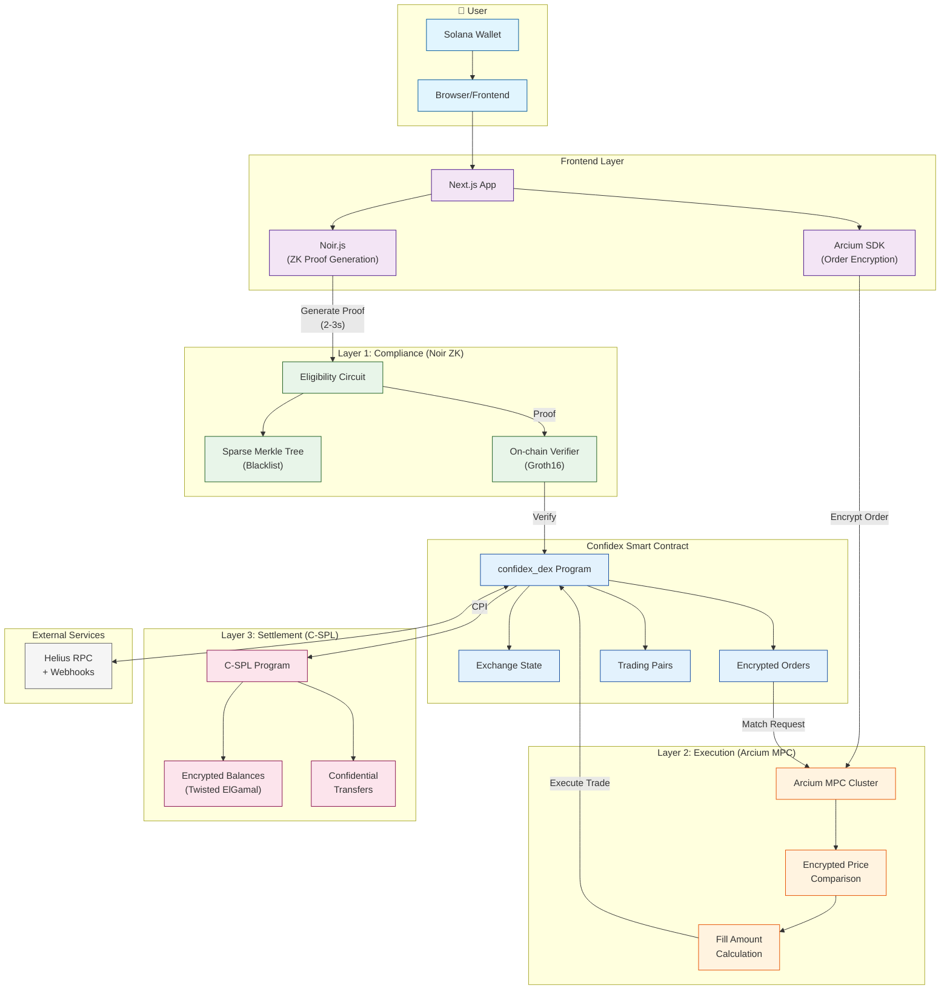

# Confidex Architecture

## Three-Layer Privacy Architecture

### Layer 1: Compliance (Noir ZK Proofs)
- **Purpose**: Prove trading eligibility without revealing identity
- **How**: Sparse Merkle Tree non-membership proof
- **Result**: User proves they're NOT on blacklist without exposing their address

### Layer 2: Execution (Arcium MPC)
- **Purpose**: Match orders without exposing prices or amounts
- **How**: Multi-party computation across distributed nodes
- **Operations**:
  - `buy_price >= sell_price` (encrypted comparison)
  - `min(buy_remaining, sell_remaining)` (fill calculation)
- **Result**: MEV-protected, private order matching

### Layer 3: Settlement (C-SPL Tokens)
- **Purpose**: Maintain encrypted balances on-chain
- **How**: Twisted ElGamal homomorphic encryption
- **Result**: Persistent privacy—balances never exposed publicly

## Data Flow

1. **User connects wallet** → Frontend
2. **Frontend generates ZK proof** → Proves eligibility (2-3 seconds)
3. **Frontend encrypts order** → Via Arcium SDK
4. **Submit transaction** → Proof + encrypted order params
5. **On-chain verification** → ZK proof checked by verifier
6. **Order stored** → Encrypted in program state
7. **Matching triggered** → Arcium MPC compares prices
8. **Settlement** → C-SPL confidential transfers execute
9. **Confirmation** → Helius webhooks notify frontend
