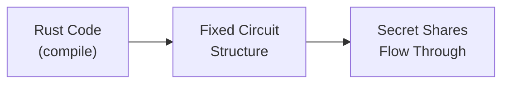

# Thinking in MPC

> Understand the mental model behind Arcis and why MPC circuits work differently from regular code

Arcis lets you write Rust that computes on encrypted data. But MPC (Multi-Party Computation) has fundamental constraints that affect how you write code. This page explains *why* these constraints exist so you can write effective Arcis programs.

**Tip:** Use this page to build intuition for how Arcis works. Understanding these concepts will help you write efficient circuits. If you prefer hands-on learning, try the [Hello World tutorial](../hello-world.md) alongside this guide.

## How Secret Sharing Works

When you call `.to_arcis()` on encrypted data, it does not decrypt the data. Instead, it converts the ciphertext into **secret shares** distributed across ARX nodes (Arcium's MPC execution nodes).

Think of it like splitting a secret number into random pieces:

```
Secret value: 42

Node A holds: 17  (random)
Node B holds: 93  (random)
Node C holds: -68 (calculated so shares sum to 42)
```

**Key insight:** Each node sees only random-looking data. No single node learns anything about the original value. But when nodes compute together following the MPC protocol, the math works out correctly.

**Security guarantee**: All ARX nodes would need to collude together to reconstruct the secret. As long as even one node refuses to participate, the secret remains protected.

```rust
#[instruction]
pub fn double_secret(input: Enc<Shared, u64>) -> Enc<Shared, u64> {
    // Convert encrypted data to secret shares across nodes
    let value = input.to_arcis();

    // Each node multiplies their share by 2
    // The shares still reconstruct to the correct answer!
    let result = value * 2;

    // Convert secret shares to encrypted output
    input.owner.from_arcis(result)
}
```

This is why Arcis code looks like normal Rust but runs on encrypted data—the MPC protocol handles the complexity of computing on shares.

## The Circuit is Compiled Once

Here's the crucial insight: **your Arcis code compiles into a fixed circuit structure before any data flows through it.**



The circuit structure—which operations happen, in what order, how many times—is locked in at compile time. Secret data flows through this fixed structure at runtime.

**This is the root cause of all Arcis constraints.** If the circuit structure could change based on secret data, observers could learn information by watching *how* the computation runs, not just *what* it outputs.

## Both Branches Always Execute

In normal code, `if/else` picks one branch to run:

```rust
// Normal Rust: only ONE branch executes
if condition {
    do_expensive_thing();  // Runs if true
} else {
    do_cheap_thing();      // Runs if false
}
```

In Arcis, when the condition is **not a compile-time constant**, both branches execute:

```rust
// Arcis: BOTH branches execute, condition selects the result
let secret_value = encrypted_input.to_arcis();  // Now secret-shared across nodes
let is_large = secret_value > 1000;             // Comparison result is also secret

if is_large {        // No single node knows this value
    expensive()      // Always runs
} else {
    cheap()          // Always runs
}
// Cost = cost(expensive) + cost(cheap)
```

In the example above, after `.to_arcis()`, no individual node knows the actual value—each holds a random-looking share. The condition `is_large` is itself secret-shared, meaning no node can determine which branch "should" execute. The MPC protocol executes both branches, then uses the secret condition to select which result to keep—without revealing which branch applied.

**The rule:** If a condition is not a compile-time constant, Arcis executes both branches. This includes:

* Conditions derived from secret data (via `.to_arcis()`)
* Conditions using public runtime parameters

**The exception:** Compile-time constants like `if true { ... }` or `if CONST > 5 { ... }` allow single-branch execution because the value is known during circuit compilation.

**Compile-time constant**: A value the Arcis compiler can determine before circuit generation—literals like `10`, `const` declarations, or expressions involving only constants. Values from function parameters or `.to_arcis()` results are NOT compile-time constants.

**Cost implication**: The cost of an `if/else` is the sum of both branches, not the max. Keep branches balanced when possible.

## Fixed Iteration Counts

Loops must have iteration counts known at compile time:

```rust
// ✓ Works: iteration count is fixed
for i in 0..100 {
    process(data[i]);
}

// ✗ Won't compile: iteration count depends on runtime value
while secret_value < threshold {
    secret_value += 1;
}
```

**Why no `while` loops?** The number of iterations would depend on secret data:

* Secret starts at 10 → 90 iterations → takes X time
* Secret starts at 99 → 1 iteration → takes X/90 time

Execution time would leak information about the secret value.

**Why no `break` or `continue`?** Same reason—early exit based on secret data reveals information:

```rust
// ✗ Won't compile
for i in 0..1000 {
    if found_match { break; }  // Would reveal when match occurred
}
```

## Fixed-Size Data Only

Variable-length types like `Vec`, `String`, and `HashMap` are not supported:

```rust
// ✗ Not supported
let items: Vec<u8> = vec![];
let name: String = String::new();

// ✓ Use fixed-size alternatives
let items: [u8; 100] = [0; 100];
let name: [u8; 32] = [0; 32];
```

**Why?** The circuit compiler must know exactly how much memory and how many operations your circuit needs. A `Vec` that might hold 10 or 10,000 elements would create a circuit of unknown size.

## Reveal and Encryption Placement

The `.reveal()` and `.from_arcis()` methods **cannot be called inside `if/else` blocks** when the condition is not a compile-time constant:

```rust
// ✗ Won't compile - reveal inside conditional
if secret_condition {
    value.reveal()  // Error: cannot call reveal in conditional execution
}

// ✓ Works - select first, then reveal outside
let selected = if secret_condition { a } else { b };
selected.reveal()
```

**Why?** Both branches execute in isolation before results are merged. `.reveal()` broadcasts data to all parties—a global side effect that cannot be undone during the merge. If reveal happened inside a branch, it would leak which branch was taken.

The same applies to `.from_arcis()`:

```rust
// ✗ Won't compile
if secret_condition {
    owner.from_arcis(value)  // Error
}

// ✓ Works
let result = if secret_condition { a } else { b };
owner.from_arcis(result)
```

## Dynamic Indexing is O(n)

When the index is known at compile time, array access is O(1):

```rust
let x = arr[5];  // Compile-time index: O(1)
```

When the index depends on secret data, it becomes O(n):

```rust
let x = arr[secret_idx];  // Secret index: O(n)
```

**Why?** The circuit cannot reveal which index was accessed. It must check all positions and select the right one without leaking which position matched. For small arrays this is fine; for large arrays, consider your access patterns carefully.

## Cost Model

Not all operations are equal in MPC. Here's a practical cost ranking:

| Operation                      | Relative Cost          | Notes                       |
| ------------------------------ | ---------------------- | --------------------------- |
| Addition, subtraction          | Nearly free            | Local computation on shares |
| Multiplication by constant     | Nearly free            | Local computation           |
| Multiplication                 | Cheap                  | Optimized via preprocessing |
| Comparisons (`<`, `>`, `==`)   | Expensive              | Bit-by-bit operations       |
| Division, modulo by power of 2 | Expensive              | Bit shift operations        |
| Division, modulo (general)     | Very expensive         | Iterative algorithms        |
| Dynamic array indexing         | O(n)                   | Must check all positions    |
| Sorting                        | O(n·log²(n)·bit_size)  | Fixed comparison pattern    |

**Optimization tip:** Batch operations when possible. Multiple `.from_arcis()` calls have overhead—restructure to minimize conversions between encrypted and secret-shared forms.

## Rust Patterns That Need Adjustment

Arcis is Rust, but some common patterns need adaptation:

| Standard Rust                 | Arcis Equivalent             | Why                           |
| ----------------------------- | ---------------------------- | ----------------------------- |
| `Vec<T>`                      | `[T; N]`                     | Fixed size required           |
| `String`                      | `[u8; N]`                    | Fixed size required           |
| `while condition { }`         | `for i in 0..MAX { }`        | Fixed iterations              |
| `match`                       | Nested `if/else`             | `match` not supported yet     |
| `break`, `continue`, `return` | Restructure logic            | No early exit                 |
| `.filter()`                   | Manual loop with conditional | Would produce variable length |
| `HashMap`                     | Arrays with manual lookup    | Fixed size required           |

## Syntax Constraints

A few syntax rules to keep in mind:

* **`if`, `else`, and `else if` all work normally** — but remember: when the condition is not a compile-time constant, both branches execute (MPC cost = sum of all branches)
* **`.reveal()` and `.from_arcis()` cannot be called inside `if/else` blocks when the condition is not a compile-time constant** — if the condition is a compile-time constant (like `if true`), only one branch runs and reveal is allowed inside
* **No `match`**: Use `if/else` chains instead
* **No early `return`**: Functions must have a single exit point
* **No `while`, `loop`, `break`, `continue`**: Use `for` loops with fixed bounds
* **Enums**: Not supported yet

## What You Learned

* **Secret sharing splits data across nodes** — no single node sees the actual value
* **Circuits are fixed at compile time** — structure cannot depend on secret data
* **Both branches execute** — MPC cost is the sum, not max
* **Loops need fixed bounds** — no `while`, `break`, or `continue`
* **Use fixed-size types** — `[T; N]` instead of `Vec<T>`
* **Reveal outside conditionals** — `.reveal()` and `.from_arcis()` are global operations
* **Dynamic indexing is O(n)** — the circuit checks all positions
* **Comparisons are expensive** — additions and multiplications are cheap

## What's Next?

Now that you understand the mental model:

| Resource | Description |
|----------|-------------|
| [Types](types.md) | Supported types including integers, arrays, and encrypted types |
| [Input/Output](input-output.md) | Working with `Enc<Owner, T>` for encrypted data |
| [Operations](operations.md) | Complete operation support matrix |
| [Quick Reference](quick-reference.md) | Concise syntax lookup while coding |

---

> To find navigation and other pages in this documentation, fetch the llms.txt file at: https://docs.arcium.com/llms.txt
