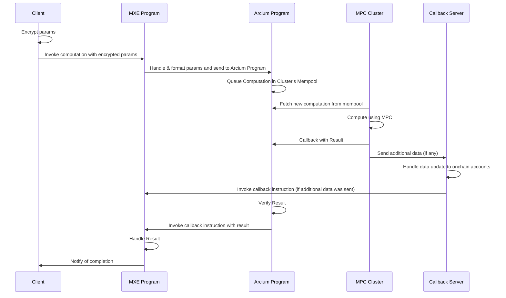

# Computation Lifecycle

Before diving into the details of the tooling, it's useful to understand the general architecture of Arcium. The below diagram gives a high-level overview of the lifecycle of a typical interaction with Arcium (we call these "computations").

We have 4 key actors here (with one additional participant if needed):

* **The Client**: The party that wants to perform a computation, usually the user of your MXE. This is implemented using the [Arcium TypeScript Client Library](js-client-library/README.md).

* **The MXE Program**: Your app. An MXE (MPC eXecution Environment) consists of everything needed to perform computations and is implemented using the [Arcium program tooling](program/README.md):
  * A smart contract that is deployed on the blockchain and is used to format and submit computations to Arcium.
  * A set of confidential instructions (we call these "computation definitions") that are used to define what parameters are needed for the computation and what the computation is. Writing these is done using [Arcis](arcis/README.md).
  * Some metadata about the MXE, most importantly the MPC cluster we would like to use to compute our computations.

* **The Arcium Program**: The program in charge of assigning, scheduling, and verifying computations for the various MPC clusters to perform.

* **The MPC Cluster**: The parties that are performing the client's computations using MPC.

* **The Callback Server**: A server that is used to handle additional data from the MPC cluster. This is optional and only needed for cases when the computation result is more than what can fit in a single Solana transaction.

---

> To find navigation and other pages in this documentation, fetch the llms.txt file at: https://docs.arcium.com/llms.txt
